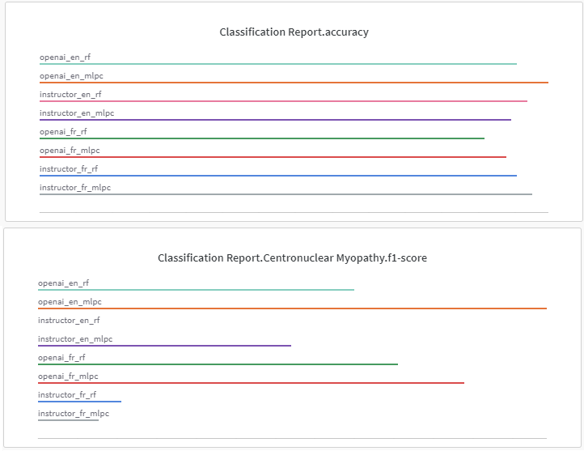

# Benchmarking Embbedding Models - OpenAI vs Instructor

_A real-life example of Embedding Models performances_

<!-- more -->

---

## Introduction

With ChatGPT and GPT-4, OpenAI API is very popular for any large language models (LLMs) workflow implementation. One popular workflow is raw text classification: you input a text, you get a label. It can be anything: sentiment, diagnosis, toxicity. Text classification is based on the concept of embeddings: turning text into a high-dimension numerical vector that captures the semantic meaning of your text.

OpenAI embeddings models are fast and simple to use, but they represent a privacy issue: you might not want to send your private data to an external API ([even if they claim to not keeping your data and not using them for training in their ToS](https://openai.com/policies/api-data-usage-policies). The idea of this blog post is to compare the embedding models performances of [OpenAI embeddings](https://platform.openai.com/docs/guides/embeddings) to self-hosted solution available such as [Instructor-Large](https://huggingface.co/hkunlp/instructor-large) on real-life data.

**I've done this benchmark because I'm actively developing tools based on LLM to process and exploit biomedical text data to help with research on rare disease: check out NLMyo [https://github.com/lambda-science/NLMyo](https://github.com/lambda-science/NLMyo)** and its [online demo](https://lbgi.fr/NLMyo/).

## Methodology

Here we will be trying to do diagnosis prediction. As a dataset, I have 138 fully anonymized text reports describing muscle biopsy observations in french natural-language and the associated diagnosis as label.  
Table with each label counts:

<!-- prettier-ignore -->
| Disease                  | Count |
|--------------------------|-------|
| Core Myopathy            | 48    |
| Nemaline Myopathy        | 44    |
| NON-CM-OTHER             | 30    |
| Centronuclear Myopathy   | 16    |

To compare embedding performances I embedded the data and trained a classification algorithm using a 10-fold cross-validation. Here is a list of comparison I made:

- OpenAI embedding vs Instructor-Large embeddings
- Raw French text (`fr`) vs English translated text (`en`) (through DeepL API)
- Multi-layer perceptron (`mlpc`) vs Random Forest classifier (`rf`) (with GridSerach optimization)

## Results

Full results are accessible here: [https://wandb.ai/lambda-science/myo-text-classify](https://wandb.ai/lambda-science/myo-text-classify)  
Here is the Summarized results:
  
From a quick overview of the results, we can notice a few things:

- In terms of general **accuracy: all conditions performed more or less equally** (OpenAI vs Instructor vs French vs English vs MLPC vs Random Forest). Differences look negligible in terms of accuracy, but the best performing model is OpenAI embedding on translated text (English) using a multi-layer perceptron.

- However there is a **strong difference in the models for the minority class classification.**

  - **OpenAI performed way better** in all comparison than Instructor embedding in all situations. The difference is huge for the minority class, less significative for the other classes.
  - More surprisingly, **embedding translated text allowed the model to have better performance** than embedding raw French text for OpenAI (less significative for Instructor).

- Finally, multi-layer perceptron seems to outperform random forest in all comparison. But with unseen reports, random forest seems to be more reliable, I suspect there is a strong overfit with MLPC models.

In conclusion, I can say that from a performance point a view: the best decision for text classification is still using OpenAI embedding but also to translate your texts into English first. However open-source models are still capable and will hopefully improve in the near future for self-hosted, private solutions solving data-privacy issues.

**For more information about biomedical data research and LLMs you can follow me on twitter: [@corentinm_py](https://twitter.com/corentinm_py)**
