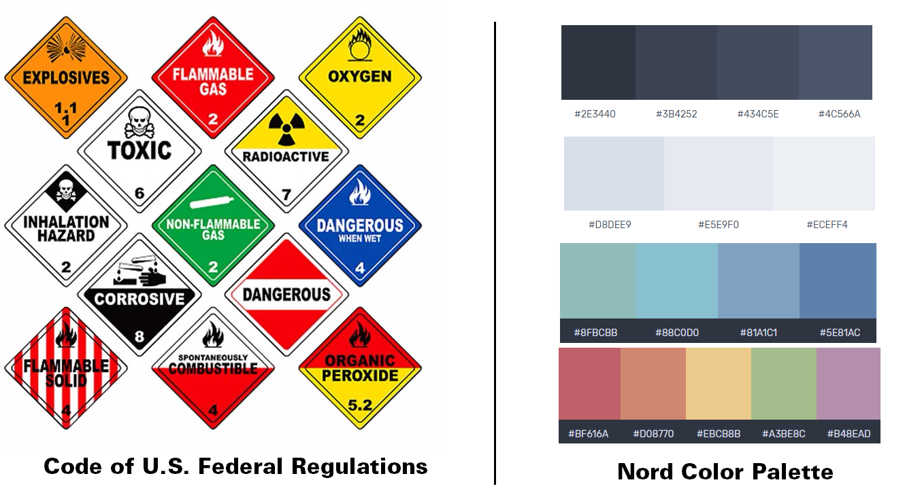
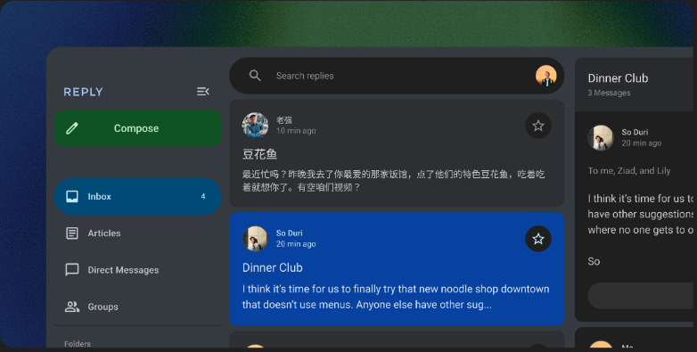
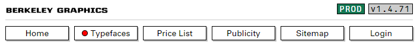
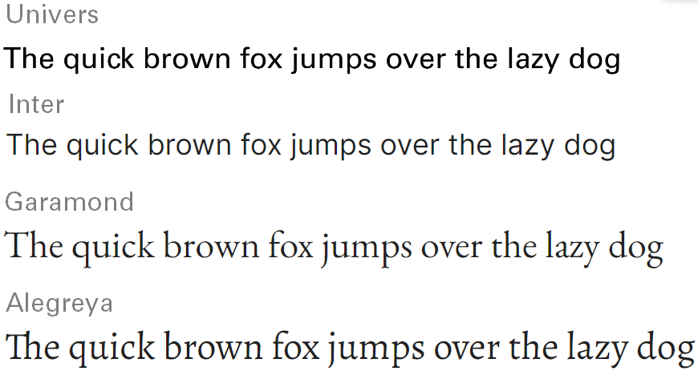
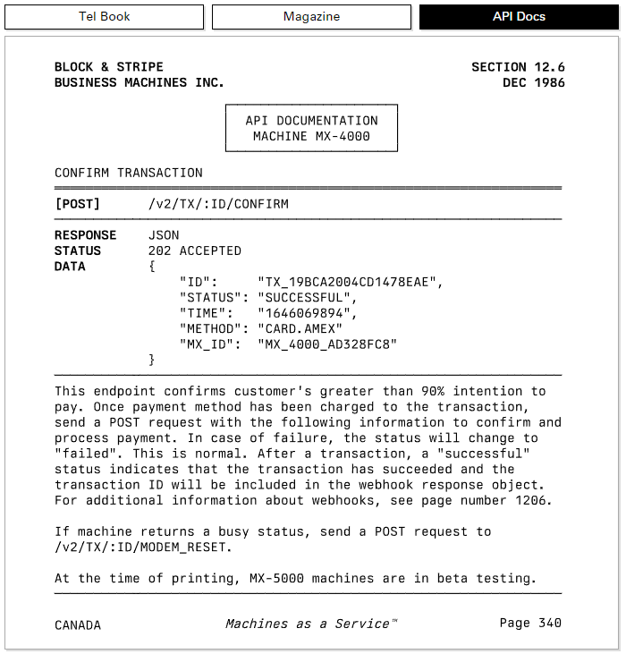

# Graphic design choices for an engineering mood

_Choosing fonts, colors and shapes to set the right feeling while avoiding round corners._

<!-- more -->

---

## Design choices immediately set the mood

If you've been studying computer science, chances are that you also had that professor that has a personal website [like this](https://www.motherfuckingwebsite.com/), without any CSS, no colors, no animations, pure content, just like the pure performance of [Disk Prices website](https://diskprices.com/). This is what peak performance looks like, but it's a strong minority of websites.

In the first few seconds of opening a new web page, your perception of the design choice, including fonts, colors, shape of elements and arrangement of elements immediately set your mood and first opinion of it.

Companies such as Apple, Google and all tech start-ups understood this and play with these parameters to shape their product image. Take Apple's [macOS Ventura page,](https://www.apple.com/fr/macos/ventura/) for example. It's made of a lot of free space, big fonts, animation, colorful texts, images, round shape boxes and free space. This page gives a consumer-friendly vibe that is playful, easy-to-use and enjoyable products.

For a long time I was digging this look, and wanted to mimic it. However now I feel burnt out of it, everything looks similar. Until I discovered [Berkeley Graphics](https://berkeleygraphics.com/) and its [twitter account](https://twitter.com/berkeleygfx). It's a type foundry that creates graphic guidelines focusing on engineering standards. Their website feels very different, it tickles some kind of simple yet efficient string in me. I would say it was love at first sight. I was wondering why and how. How to make design choices that are giving a professional and engineering mood, instead of a slightly childish, consumer-friendly one.

## It's all about design philosophy

Actually, Berkeley Graphics states very clearly their design philosophy on their website, it's made of 13 rules:

- Emergent over prescribed aesthetics.
- Expose state and inner workings.
- Dense, not sparse.
- Explicit is better than implicit.
- Regiment functionalism.
- Performance is design.
- Verbosity over opaqueness.
- Ignore design trends. Timeless and unfashionable.
- Flat, not hierarchical.
- Diametrically opposite of minimalism. As complex as it needs to be.
- Driven by specifications and datasheets.
- Beauty emerges automatically without deliberation.
- Do not infantilize users.

You don't have to remember everything but I feel like if you're making something for professionals and experts: it all comes down to one principle: **the first goal is to expose all needed information without fearing complexity.**

## Make the right design choices

Whatever design horizon you choose, you will need to select at least three elements: colors, shapes and fonts. Here I will try to describe a few of these elements I like.

### Colors: pop colors or light pastel ?

You probably saw these colors and thought, "Hey, I know these colors !". They are Google's logo colors and illustrate exactly how a color scheme can define a brand. You have different choices in the colors you pick, from very saturated pop colors to light pastel ones, all defining a different feel. For example, personally I prefer for now light pastel colors, such as the [Nord Theme](https://www.nordtheme.com/) (see image below). These soft bluish colors are soothing for the eyes. Additionally I made them a little bit more saturated for dark-theme terminal using [Themer.dev](https://themer.dev), you can find my theme [here](<https://themer.dev/?colors.dark.accent0=%23f07178&colors.dark.accent1=%23f78c6c&colors.dark.accent2=%23ffcb6b&colors.dark.accent3=%23c3e88d&colors.dark.accent4=%2389ddff&colors.dark.accent5=%2382aadb&colors.dark.accent6=%23c792ea&colors.dark.accent7=%23da70d6&colors.dark.shade0=%231A1A1A&colors.dark.shade1=%23212121&colors.dark.shade2=%23353535&colors.dark.shade3=%234a4a4a&colors.dark.shade4=%23a29da3&colors.dark.shade5=%23C1BCC2&colors.dark.shade6=%23E0DCE0&colors.dark.shade7=%23FFFCFF&colors.light.accent0=%23F03E4D&colors.light.accent1=%23F37735&colors.light.accent2=%23EEBA21&colors.light.accent3=%2397BD2D&colors.light.accent4=%231FC598&colors.light.accent5=%2353A6E1&colors.light.accent6=%23BF65F0&colors.light.accent7=%23EE4EB8&colors.light.shade0=%23eceff4&colors.light.shade1=%23d7dde8&colors.light.shade2=%23b3bed5&colors.light.shade3=%23707a8c&colors.light.shade4=%234c566a&colors.light.shade5=%23434c5e&colors.light.shade6=%233b4252&colors.light.shade7=%232e3440&activeColorSet=dark&calculate[Inter](https://fonts.google.com/specimen/Inter?preview.text_type=paragraph&query=inter&stylecount=1)mediaryShades.dark=true&calculate[Inter](https://fonts.google.com/specimen/Inter?preview.text_type=paragraph&query=inter&stylecount=1)mediaryShades.light=false>).

One interesting color schema inspiration would come from official government documents, such as these colors coming from the U.S. Federal Regulations. Colors on these pictograms have been chosen with high attention to be seen and understood by a hundred millions of people and preventing accidents. They are a great source of inspiration for a very functional color scheme that transmits an industrial vibe to a product.

### Shapes: leave round corners for square corners

Over recent years, there has been a significant shift in the UX design towards rounded corners. Whereas it is Apple, Google or any of your favorite application, there is a strong chance that they use rounded the corner button. Below is an image from Material Design example, the Google's design system, used in Android and all their app. Everything is round and more importantly it's a huge loss of space. _Round corners are a loss of space_. Maybe it feels fresh to you, but not to me anymore.

A refreshing trend in UI shows that square corners can actually produce a great effect. As seen below, from the menu of Berkeley Graphics website, square corners with a light bottom right shade are very simple yet highly effective to represent buttons. This design choice gives a more "engineering, industrial and retro" feeling than the previous one, while maximizing readability and usage of free space.

### Fonts: recognizable yet forgettable

Fonts are subconsciously important. People don't notice it, but they can feel when a font changed or is different. To simplify there are two types of font: serif and sans-serif. Serif fonts are your newspaper fonts, great for printed books and wall of texts, they use small decorations for letters, a classic example is `Time New Roman`. Sans Serif fonts are your typical online fonts, for websites, brand logos and application, a classic example is `Helvetica`.

However both these fonts have been overused, mainly by Apple for example for Helvetica, but also on any public sign and brand logo. Helvetica is everywhere and you don't notice it anymore (that's actually part of the genius behind it). It has been used so much that Apple had to create their own personal font called San Francisco to replace it from their products.

Font choice comes down to personal preference, but I have some recommendation that I like. Basically, you want a Helvetica look alike that is not Helvetica, that's why I suggest [Univers](https://www.linotype.com/fr/1212814/univers-famille.html) (developed the same year and very similar) as a paid option and [Inter](https://fonts.google.com/specimen/Inter?preview.text_type=paragraph&query=inter&stylecount=1) as a free and open-source alternative for Sans Serif font.

For Serif font, instead of the good old Times New Roman, I suggest the classic [Garamond](https://fonts.google.com/specimen/EB+Garamond?preview.text_type=paragraph&query=garamond&stylecount=1) (or [Alegreya](https://fonts.google.com/specimen/Alegreya?preview.text_type=paragraph&query=aleg&stylecount=1) for a more risky choice).

Lastly, for coding and technical specificationn we need a third type of fonts called Mono-Spaced Fonts. In these types of fonts all letters have the same width, creating aligned vertical columns in the text. This is absolutely needed in terminal and code editors.

For this I have to absolutely recommend [Berkeley Mono](https://berkeleygraphics.com/typefaces/berkeley-mono/), it's a paid font (75$) but I've fallen in love with it and it's the source of inspiration for this post. (Actually, I haven't bought it yet, but I probably will in a near future, when I have a real job.) I mean just look at this:

It's a mono-spaced font, inspired from Adrian Frutiger's genius (creator of the [Univers](https://www.linotype.com/fr/1212814/univers-famille.html) font) and it has a very pronounced engineering and retro vibe to it. It looks well fitted not only for code but also for any specific technical document. For free alternatives you have different very good mono-spaced fonts such as my favorite [Hack](https://sourcefoundry.org/hack/), but [Jetbrains Mono](https://www.jetbrains.com/fr-fr/lp/mono/), [Source Pro](https://fonts.google.com/specimen/Source+Code+Pro) and [Fira Code](https://fonts.google.com/specimen/Fira+Code?preview.text_type=paragraph) are all great alternatives.

|                 |                            Commercial Font                             |                                                                                                                          Free Font                                                                                                                          |
| --------------- | :--------------------------------------------------------------------: | :---------------------------------------------------------------------------------------------------------------------------------------------------------------------------------------------------------------------------------------------------------: |
| **Sans Serif**  |  [Univers](https://www.linotype.com/fr/1212814/univers-famille.html)   |                                                                            [Inter](https://fonts.google.com/specimen/Inter?preview.text_type=paragraph&query=inter&stylecount=1)                                                                            |
| **Serif**       |                                   /                                    |               [Garamond](https://fonts.google.com/specimen/EB+Garamond?preview.text_type=paragraph&query=garamond&stylecount=1) & [Alegreya](https://fonts.google.com/specimen/Alegreya?preview.text_type=paragraph&query=aleg&stylecount=1)                |
| **Mono Spaced** | [Berkeley Mono](https://berkeleygraphics.com/typefaces/berkeley-mono/) | [Hack](https://sourcefoundry.org/hack/) ([Jetbrains Mono](https://www.jetbrains.com/fr-fr/lp/mono/), [Source Pro](https://fonts.google.com/specimen/Source+Code+Pro), [Fira Code](https://fonts.google.com/specimen/Fira+Code?preview.text_type=paragraph)) |

## Closing Thoughts

I hope that with this blog post you learned a bit about graphic design choices, especially in terms of fonts, colors and shapes and how you can use these tools to give a specific vibe to your projects. I want to share a bit more resources about this, namely this [magnificent blog](https://neil.computer/) from Berkely Mono creator and this [engineering aesthetic](https://twitter.com/eng_aesthetics) Twitter account. On a side note, thinking about engineering aesthetic made me like the [brutalism aesthetic](https://www.instagram.com/brutgroup/) that has some kind of special place in my heart.

**Anyways, this closes this blog post. Don't hesitate to share with me what color scheme, font and design choice you prefer. You can also follow me on twitter to keep you updated on my posts: [@corentinm_py](https://twitter.com/corentinm_py)**
