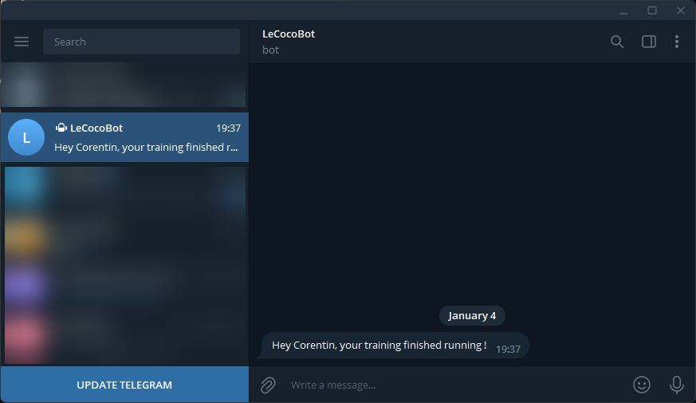

# TIL - Good bye emails welcome Telegram Alerts

_How to send a telegram alert when your code finished running_

<!-- more -->

---

If you're doing machine learning or any kind of analysis using Python, you probably have been in a situation where you launch scripts that takes several minutes or hours to complete. In these situations you want to have a way to be notified that they finished with success.  
You have different solutions for this, but my favorite for now that I will show you in this TIL is to create a Telegram Bot that can send you message alerts directly on your phone.

This is very simple to set up and also compatible with any language that can make a simple GET/POST request.

**Telegram Bot Setup**

1. On your telegram account, send a DM containing `/newbot` to `https://t.me/BotFather` to create your bot. You will receive a token. Save this token.
2. Then search for your bot name using the search bar and send it a message. And visit `https://api.telegram.org/bot<YOUR_BOT_TOKEN>/getUpdates` You will find here a JSON containing your account chatID inside: `result.0.message.from.id: <YOUR_CHAT_ID>`. Save this ID.
3. With this token and this ID you can now send yourself alerts using some simple GET request to the URL `https://api.telegram.org/bot<YOUR_BOT_TOKEN/sendMessage?chat_id=<YOUR_CHAT_ID>&text=<TEXT_OF_THE_ALERT>`

Here is an example of a function in pure python that you can copy paste in your code and call to send an alert easily:

```python
import requests
def send_telegram_alert(message="Finished Running"):
	# Replace 'YOUR_BOT_TOKEN' with the token you received from the BotFather
	bot_token = "<YOUR_BOT_TOKEN>"
	# Replace 'YOUR_CHAT_ID' with your Telegram chat id
	chat_id = "<YOUR_CHAT_ID>"
	# Set the API endpoint and the message text
	api_endpoint = f"https://api.telegram.org/bot{bot_token}/sendMessage"

	# Make the API request
	response = requests.post(api_endpoint, json={"chat_id": chat_id, "text": message})
send_telegram_alert("Hey Corentin, your training finished running !")
```

But you can also do the same for bash scripts !

```bash
bot_token='<YOUR_BOT_TOKEN>'
chat_id='<YOUR_CHAT_ID>'
api_endpoint="https://api.telegram.org/bot$bot_token/sendMessage"
message_text='Hey Corentin, your training finished running !'
curl -s -X POST $api_endpoint -d chat_id=$chat_id -d text="$message_text"
```

And you could even do specific alerts when something failed:

```python
try:
	my_main_script_func()
	send_telegram_alert("Your script finished running !")
except:
	send_telegram_alert("Woops, something went wrong !")
```

I think that a pretty cool tool simpler than email, effortless to setup and faster than manually checking !
