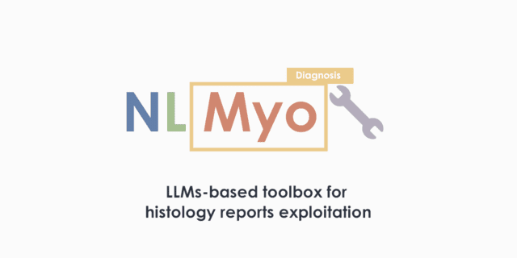
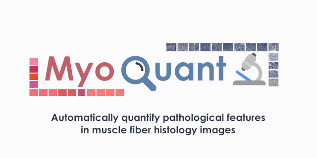
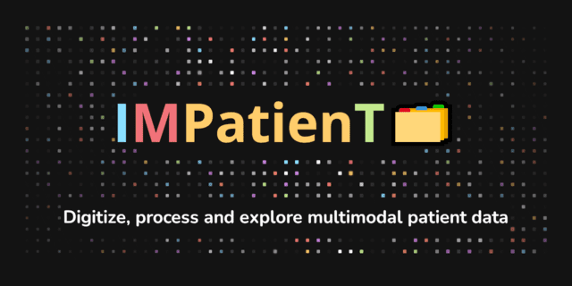

#

<figure markdown>

  
  <figcaption><strong>Corentin Meyer</strong> Biology & AI PhD Student Machine-Learning Engineer</figcaption>

</figure>

## Lambda Science - Science and data for ordinary people.

I'm Corentin Meyer. A 3rd year PhD Student in biology and AI in Strasbourg. This is my personal website and blog that to communicate concepts about science, code and data.  
Blog posts here: **[Blog & TILs](blog/index.md)**. More about me & projects here: **[About Me](aboutme.md)**.  
My current main projects are [NLMyo](https://github.com/lambda-science/NLMyo)🔧, [MyoQuant](https://github.com/lambda-science/MyoQuant)🔬 and [IMPatienT](https://github.com/lambda-science/IMPatienT)🗂️

- [:simple-twitter: **Twitter** @corentinm_py](https://twitter.com/corentinm_py)
- [:material-email: **Email** lambdascience@tutanota.com](mailto:lambdascience@tutanota.com)
- [:simple-github: **GitHub** @lambda-science](https://github.com/lambda-science)
- [:simple-linkedin: **LinkedIn** Corentin Meyer](https://www.linkedin.com/in/corentin-m-78056887/)

  
    
      

